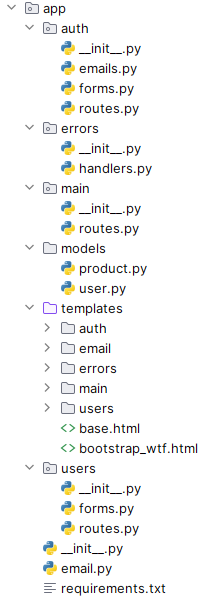

# CITS5505 Web Project.  v1.0.0.

Allow users to sell ("making a request") and buy ("answering the request") NFT-like images automatically generated by the site. Rewards for collecting certain sets of images? No actual cryptocurrency-related functionality required!

## Project members

| UWA ID  | Name | Github Username |
|---------|------|-----------------|
|24055729 |Nandani Patel|Nandani-06|
|23980376 |Sai Charan Pokuri|saicharan0812000|
|24090236 |Konstantin Tagintsev|ktagintsev|
|24079185 |Md Rayhan Chowdhury|rayhan|

## Features

- User login 
- Registration
- Forgot password 
- Reset password
- Change password
- View profile
- Edit profile
- Dockerization

### Video

[](https://www.youtube.com/watch?v=ZKMMH4Nb8eM "Image Store v1.0.0")

### Application architecture



### Technologies

- HTML5
- Bootstrap (CSS, JavaScript)
- Flask
- SQLite

## Instructions on how to launch the application

### Run the application loclaly:
```
python3 -m venv .venv
. .venv/bin/activate
```

```
pip install -r requirements.txt
flask run  --debug
```

Access the app at: http://127.0.0.1:5000


### Run in docker
```
docker build -t store-app .
docker run -d --rm  -v `$PWD`:/app/webapp -p 5000:5000 --name store-app store-app

# Run flask app
docker exec -it store-app python -m flask run --host=0.0.0.0 --debug

```
Access the app at: http://localhost:5000


```
aiosmtpd -n -c aiosmtpd.handlers.Debugging -l localhost:8025
```

## Instructions on how to run the tests

### To run unit tests:
```
cd tests
python -m unittest unittests.py
```

### To run user tests (Selenium):
<span style="color:red;">**The Selenium tests only work for Windows users who have Chrome installed!**</span>

Run the app with **FLASK_CONFIG = 'test'** before running the test.
```
cd tests
python -m unittest usertests.py
```

## References:

https://getbootstrap.com/docs/4.0/examples/jumbotron/
https://geeksui.codescandy.com/geeks/index.html
https://mdbootstrap.com/docs/standard/extended/profiles/
https://pypi.org/project/selenium/

## License Info

This project is licensed under the MIT License.


