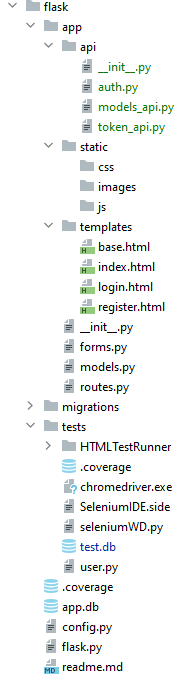

# CITS5505 Web Project

Allow users to sell ("making a request") and buy ("answering the request") NFT-like images automatically generated by the site. Rewards for collecting certain sets of images? No actual cryptocurrency-related functionality required!

## Features


- front-end
	- 
- backend
	- 

- basic structure
	- file, flask
	- html

- Home page
- Users 
  - register
  - logn
  - forgot password
  - profile
  	- view
  	- update
  	- rewards 
- User Dashboard
  - Display a summary of activity
- Reqeusts
  - Market
  	- Browse requests
  	- Search reqeusts (list images)
  - Sell
	 - Submit request
	 - Generate NFT-like images
  - Buy
  	- Accept request
- About us page
- Feedbaks / contact-us


- deployments, containerisation
- test cases
- deliverables


## Project members

| UWA ID  | Name | Github Username |
|---------|------|-----------------|
|24090236 |Konstantin Tagintsev|ktagintsev|
|24055729 |Nandani Patel|Nandani-06|
|23980376 |Sai Charan Pokuri|saicharan0812000|
|24079185 |Md Rayhan Chowdhury|rayhan|

## Breif architecture summary

Client-Server, MVC

### Application architecture



breif on architecture, diagrams, flow chart, database structure, etc.


### Technologies

- HTML5
- CSS
- Javascript
- AJAX
- Bootstrap
- JQuery
- Flask
- SQLite

## Instructions on how to launch the application

### Run the application loclaly:
```
python3 -m venv .venv
. .venv/bin/activate
```

```
pip install -r requirements.txt
flask run  --debug
```

Access the app at: http://127.0.0.1:5000


### Run in docker
```
docker build -t store-app .
docker run -d --rm  -v `$PWD`:/app/webapp -p 5000:5000 --name store-app store-app

# Run flask app
docker exec -it store-app python -m flask run --host=0.0.0.0 --debug

```
Access the app at: http://localhost:5000


```
aiosmtpd -n -c aiosmtpd.handlers.Debugging -l localhost:8025
```

## Instructions on how to run the tests

...


## References:

https://getbootstrap.com/docs/4.0/examples/jumbotron/
https://geeksui.codescandy.com/geeks/index.html
https://mdbootstrap.com/docs/standard/extended/profiles/


## License Info


Questions:

1. Do you have any particular project structure for the project? 
2. BuySell, do we need to use payments
3. Do we need to write test before each feature in project?
4. Do we write unit test in Python or only in Selenium as Selenium is mostly BDD
5. 


How documentations done in MS?
How team performancce is measured?
How story requirements are mesaured by business team?
How individual performance is measured?


